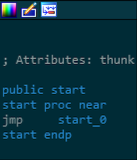

# TLS-PoC

PoC for using Thread-Local Storage callbacks in Win8.1 and above.

```
████████╗██╗     ███████╗    ██████╗  ██████╗  ██████╗
╚══██╔══╝██║     ██╔════╝    ██╔══██╗██╔═══██╗██╔════╝
   ██║   ██║     ███████╗    ██████╔╝██║   ██║██║     
   ██║   ██║     ╚════██║    ██╔═══╝ ██║   ██║██║     
   ██║   ███████╗███████║    ██║     ╚██████╔╝╚██████╗
   ╚═╝   ╚══════╝╚══════╝    ╚═╝      ╚═════╝  ╚═════╝
```

### Description

Thread-Local Storage (TLS) callbacks are a mechanism provided by the Windows loader to allow programs to perform initialisation tasks that are thread specific when a process starts. What is interesting about TLS callbacks is that they are executed *__before the entry point of the application__*, so before the ```main()``` function. This is problematic for a couple of reasons:
* Debuggers usually stop at the main function, thus _missing any extra TLS code_
* Disassemblers and static analysis tools first present the _main_ function, again leading to possibly missing hidden code.

So, unless special attention is paid to discovering whether an application has any TLS code or not, malicious code can be overlooked.

### How to create

Before creating the TLS callbacks, we need to declare the prototype for TLS callbacks:

```c
/* Pointer to a TLS callback function */
typedef void(__stdcall* TLS_CALLBACK_PTR)(void* instance, int reason, void* reserved);
```

And, for example, callbacks are then defined like this:

```c
void __stdcall tls_callback1(void* instance, int reason, void* reserved) 
{
    if (reason == DLL_PROCESS_ATTACH) {
        MessageBox(NULL, L"Hidden action in callback 1", L"Callback 1", MB_OK);
    }
}
```

If we were to compile the attached code and test it in Immunity Debugger, we would be in for a surprise:


The application executes the callback functions _and terminates_ without even giving us a chance to set up a breakpoint or view the code. The reason is because **Immunity is configured to stop by default at ```WinMain``` function**. In this case one of the TLS callbacks, which executes way before ```WinMain```, also terminates the process. To fix this, we need to change the debugging options: 

* Options ➝ Debugging Options ➝ Events ➝ *Make first pause at* System breakpoint


Immunity at least alerted us that something might be wrong. If we try to open the same compiled file in IDA Pro, the analysis begins at the ```start_0```:



This is not exactly the ```main``` function, but is way *after* the TLS callbacks. ```start_0``` is a wrapper function added by the C++ compiler on top of our manually defined ```main``` function. 

### How to detect TLS

In IDA Pro we should find the TLS callbacks in the ```TlsCallbacks``` variable, which is already extracted from the PE header:


Another nice trick to figure out if an application has any hidden code inside TLS is to use *CFF Explorer* to look inside the PE header for the ```TLS Directory```:


### Compile

The code for this PoC was compiled with **Microsoft Visual Studio Community 2019, Version 16.5.3** as a **32-bit application**. To convert it to a 64-bit program slight changes are required, which are covered in the referenced resources.

Tested on Microsoft Widows 8.1 Enterprise, Version 6.3.9600, 64-bit.

### Contribute

Please send any ideas to [reversinghub@gmail.com](mailto:reversinghub@gmail.com). If you want to contribute to the code, send a PR request. 

### References

* [Thread Local Storage - Win32](https://docs.microsoft.com/en-us/windows/win32/procthread/thread-local-storage)
* [Using C/C++ TLS callbacks in Visual Studio with your 32 or 64bits programs](http://lallouslab.net/2017/05/30/using-cc-tls-callbacks-in-visual-studio-with-your-32-or-64bits-programs/)
* [Thread Local Storage, part 3: Compiler and linker support for implicit TLS](http://www.nynaeve.net/?p=183)
