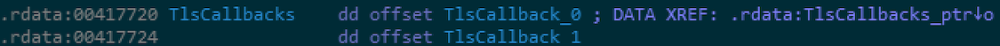

# TLS-PoC

PoC for using Thread-Local Storage callbacks in Win8.1 and above.

```
████████╗██╗     ███████╗    ██████╗  ██████╗  ██████╗
╚══██╔══╝██║     ██╔════╝    ██╔══██╗██╔═══██╗██╔════╝
   ██║   ██║     ███████╗    ██████╔╝██║   ██║██║     
   ██║   ██║     ╚════██║    ██╔═══╝ ██║   ██║██║     
   ██║   ███████╗███████║    ██║     ╚██████╔╝╚██████╗
   ╚═╝   ╚══════╝╚══════╝    ╚═╝      ╚═════╝  ╚═════╝
```

### Description

Thread-Local Storage (TLS) callbacks are a mechanism provided by the Windows loader to allow programs to perform initialisation tasks that are thread specific when a process starts. What is interesting about TLS callbacks is that they are executed *__before the entry point of the application__*, so before the ```main()``` function. This is problematic for a couple of reasons:
* Debuggers usually stop at the main function, thus _missing any extra TLS code_
* Static analysis tools 

So, unless special attention is paid to discovering whether an application has any TLS code or not, possibly malicious code can be overlooked.

### Analysis

immunity

Make first pause at:

Options  Debugging Options Events System breakpoint

default is WinMain
ida pro 





### How to detect TLS

* CFF Explorer
* command line option ?

### References

* [Thread Local Storage - Win32](https://docs.microsoft.com/en-us/windows/win32/procthread/thread-local-storage)
* [Using C/C++ TLS callbacks in Visual Studio with your 32 or 64bits programs](http://lallouslab.net/2017/05/30/using-cc-tls-callbacks-in-visual-studio-with-your-32-or-64bits-programs/)
* [Thread Local Storage, part 3: Compiler and linker support for implicit TLS](http://www.nynaeve.net/?p=183)
